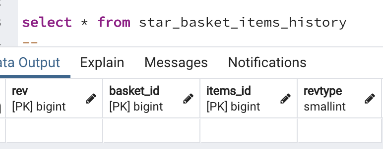

# Envers

Envers는 엔티티의 변경사항을 로깅해주는 라이브러리 입니다. 엔티티의 로깅을 위해 개발자는 save와 함께 히스토리를 같이 저장하거나 이벤트를 통해 작업을 해주었습니다.
이는 누락이 될수도 있고, 반복되는 작업을 해줘야함을 의미합니다. 이제 Envers를 통해 로깅하는 방법을 배워보겠습니다.

## 1.1 의존성

먼저 의존성을 추가해야하는데 저는 2.5.4 버전을 추가하도록 하겠습니다.

```xml
<dependencies> 
    -- Envers
    <dependency>
        <groupId>org.springframework.data</groupId>
        <artifactId>spring-data-envers</artifactId>
        <version>2.5.4</version>
    </dependency>

</dependencies>
```

## 1.2 TABLE 생성

Envers는 감사할 엔티티에 단지 @Audited 만 추가해주면 됩니다. 그러면 다음과 같은 DDL이 실행됩니다.

 로깅 테이블 생성

_envers는 hibernate.hbm2ddl.auto 옵션이 create, create-drop or update 일 경우 자동으로 테이블이 생성됩니다._

생성된 테이블을 보면 엔티티를 로깅할 entity_aud 그리고 revinfo 테이블이 생성되고 entity_aud 테이블에 외래키로 revinfo 테이블이 지정됬습니다.

만약 테이블 이름이 마음에 안든다면 org.hibernate.envers.audit_table_prefix, suffix로 지정할수 있습니다.

entity_aud 테이블은 감사할 엔티티의 필드를 저장합니다. 만일 해당 필드가 변경된 유무를 보고 싶다면 @Audited(withModifiedFlag=true) 로 설정해주면 됩니다.

_상속된 필드까지 감사하고 싶다면 @AuditOverride를 설정해주면 됩니다._

_모든 @Audited에 withModifiedFlag를 적용하고 싶다면 org.hibernate.envers.global_with_modified_flag=true 로 설정해주면 됩니다._

엔티티의 스키마는 다음과 같습니다.

 엔티티 스키마

id는 엔티티의 id를 가리키며 rev는 버전정보이며 retype는 0:생성, 1:변경, 2:삭제를 나타냅니다. 그리고 엔티티의 필드와 동일하며

withModifiedFlag가 true 였다면 field_mod 라는 컬럼도 같이 생성됩니다.

revinfo 테이블은 최초에 한번만 생성되며 모든 엔티티의 로깅을 중앙에서 감사해줍니다. 만일 같은 트랜잭션 내에

변경된 엔티티를 보고 싶다면 revinfo 테이블을 참조하면 됩니다. 스키마는 다음과 같습니다.

 revinfo 스키마

## 1.3 쿼리

 entity 생성 쿼리

 entity 변경 쿼리

 entity 삭제 쿼리

여기서 주의할점은 삭제이다. 삭제시 로깅은 어떻게 남는지 확인해보자.

 삭제후 엔티티 로깅 테이블

모든 컬럼이 null로 들어가게 되었다. 만일 삭제 전 필드의 상태로 남기고 싶다면 store_data_at_delete=true 로 설정해주면 된다.

## 1.4 조회

Envers는 감사 이력을 조회 할 수 있드록 AuditReaderFactory를 제공합니다. 원하는 정보를 필터링해서 가져올수 있도록 쿼리를 제공해줍니다. 다음은 하나의 엔티티의 모든 변경이력을 가져오는 코드 입니다.

```java
public List<Member> findRevisions(Long id) {
        return getAuditReader().createQuery()
                .forRevisionsOfEntity(Member.class, true, true)
                .add(AuditEntity.id().eq(id))
                .addOrder(AuditEntity.revisionNumber().desc())
                .getResultList();
    }

    private AuditReader getAuditReader() {
        return AuditReaderFactory.get(entityManager);
    }
```

forRevisionsOfEntity 인자로 (entity, selectEntitiesOnly, selectDeletedEntities)를 인자로 받는데 첫번째는 반환할 엔티티, 두번째는 결과에 대한 반환에 대한것인데 true이면 엔티티 리스트를 반환, false면 [엔티티, 개정 엔티티, 개정 유형] 에 대한 리스트를 반환합니다. 세번째는 삭제된 엔티티를 포함해서 반환할지에 대한 여부입니다.

## 1.5 추가 매핑 주석

### 1.5.1 @AuditTable

지금까지는 prefix, suffix를 통해 감사 테이블이름을 정했지만 단일로 이름을 지정하고 싶다면 @AuditTable을 사용하여 테이블 이름을 지정 할 수 있씁니다. 하지만 모든 엔티티에 이 주석을 사용하는 일은 반복적인 작업이므로 가능하면 prefix, suffix를 사용합니다.

### 1.5.2 @AuditOverride

앞서 설명했던 상속된 필드까지 감사할수 있도록 해주는 어노테이션입니다. 다음과 같이 사용 할 수 있으며, 상속된 필드가 여러개일 경우 @AuditOverrides를 사용하여 여러개를 지정 할 수 있습니다.

```java
@Entity
@Getter
@EqualsAndHashCode(callSuper = false)
@NoArgsConstructor
@Audited
@AuditOverride(forClass = AuditEntity.class)
public class Member extends AuditEntity {}
```

## 1.6 감사 전략

감사 전략은 감사 정보가 유지, 저장되는 방법을 정의합니다. 현재 2가지 방법을 제공합니다. 이는 org.hibernate.envers.audit_strategy를 통해 DefaultAuditStrategy, ValidityAuditStrategy 를 선택 할 수 있습니다.

- 기본 감사 전략
  - 이 전략은 시작 개정과 함께 감사 데이터를 유지합니다. 감사 테이블에 삽입, 업데이트 또는 삭제된 각 행에 대해 유효성의 시작 개정과 함께 하나 이상의 행이 감사 테이블에 삽입됩니다.
  - 감사 테이블의 행은 삽입 후에 업데이트되지 않습니다. 감사 정보 쿼리는 하위 쿼리를 사용하여 감사 테이블에서 적용 가능한 행을 선택하는데, 이는 느리고 인덱싱하기 어렵습니다.
- 유효성 감사 전략
  - 이 전략은 감사 정보의 시작 개정과 끝 개정을 저장합니다. 감사 테이블에 삽입, 업데이트 또는 삭제된 각 행에 대해 유효성의 시작 개정과 함께 하나 이상의 행이 감사 테이블에 삽입됩니다.
  - 동시에 이전 감사 행(사용 가능한 경우)의 최종 개정 필드가 이 개정으로 설정됩니다. 그런 다음 감사 정보에 ​​대한 쿼리 는 하위 쿼리 대신 시작 및 종료 개정 사이에 사용할 수 있습니다. 즉, 추가 업데이트로 인해 감사 정보를 유지하는 것이 약간 느리지만 감사 정보를 검색하는 것은 훨씬 빠릅니다.
  - 인덱스를 추가하여 개선할 수도 있습니다.

```properties
spring.jpa.properties.org.hibernate.envers.audit_strategy=org.hibernate.envers.strategy.ValidityAuditStrategy
```

```SQL
-- ValidityAuditStrategy
select
        ...
    from
        star_member_history member_his0_ 
    where
        member_his0_.rev<=? 
        and member_his0_.revtype<>? 
        and (
            member_his0_.revend>? 
            or member_his0_.revend is null
        )

-- DefaultAuditStrategy
select
        ...
    from
        star_member_history member_his0_ 
    where
        member_his0_.rev=(
            select
                max(member_his1_.rev) 
            from
                star_member_history member_his1_ 
            where
                member_his1_.rev<=? 
                and member_his0_.id=member_his1_.id
        ) 
        and member_his0_.revtype<>?
```

 유효성 검사 전략 테이블

## 1.7 개정 로그

앞서 살펴본 revinfo 테이블을 보면 rev가 Integer를 가집니다. 이는 20억정도의 데이터만 들어갈수 있으므로 커스텀을 통해 long 타입으로 변경해주면 그 이상의 데이터를 보관 할 수 있습니다. 이는 @RevisionEntity 를 통해 커스터마이징할수 있습니다. 또는 추가하고 싶은 컬럼을 추가할 수도 있습니다.

```java
@Entity
@RevisionEntity(CustomRevisionEntityListener.class)
@Table(name = "revinfo")
public class CustomRevisionEntity implements Serializable {

    @Id
    @GeneratedValue
    @RevisionNumber
    private Long id;

    @RevisionTimestamp
    private Long revtstmp;

    @Setter
    private String customColumn;
}

public class CustomRevisionEntityListener implements RevisionListener {

    @Override
    public void newRevision(Object o) {
        CustomRevisionEntity customRevisionEntity = (CustomRevisionEntity) o;
        customRevisionEntity.setCustomColumn("username");
    }
}
```

 revinfo 테이블

## 1.8 연관관계

연관관계의 엔티티가 추적하지 않는 대상이지만 현재 엔티티에서 감사를 하고 싶다면 @Audited(targetAuditMode = RelationTargetAuditMode.NOT_AUDITED)를, 연관관계 엔티티의 컬럼을 만들고 싶지 않다면 @NotAudited를 추가해주면 됩니다.

```java
Entity
@Getter
@EqualsAndHashCode(callSuper = false)
@NoArgsConstructor
@Audited
@AuditOverride(forClass = AuditEntity.class)
public class Contract extends AuditEntity {

    private String column1;

    private String column2;

    @OneToOne
    @Audited(targetAuditMode = RelationTargetAuditMode.NOT_AUDITED)
    private Draft draft;

    @OneToOne
    @NotAudited
    private Member manager;
}

@Entity
@Getter
@EqualsAndHashCode(callSuper = false)
@NoArgsConstructor
public class Draft extends AuditEntity {

    private String column1;

    private String column2;
}
```

 Contract 연관관계

만일 @OneToMany관계의 경우 다음과 같이 테이블이 생성됩니다.

 OneToMany 테이블

연관관계가 변경되는 경우 다음과 같이 데이터가 들어가게 됩니다.

 OneToMany 테이블

만일 @JoinColumn으로 지정하게 되면 @AuditJoinTable를 추가해주기만 하면 됩니다.

```java
@Entity
@Getter
@EqualsAndHashCode(callSuper = false)
@NoArgsConstructor
@Audited
@AuditOverride(forClass = AuditEntity.class)
public class Team extends AuditEntity {

    private String name;

    @OneToMany
    @JoinColumn(name = "team_id")
    @AuditJoinTable
    private List<Member> members;
}
```

## 1.9 Spring Data Envers

사용할 repository 에 RevisionRepository<Entity, Long, Long> 을 상속받아야 합니다.
각각의 매개변수는 대상이 되는 엔티티, 그 엔티티의 ID 타입, 개정 번호 유형(Integer, Long만 가능)

```java
@NoRepositoryBean
public interface RevisionRepository<T, ID, N extends Number & Comparable<N>> extends Repository<T, ID> {
    Optional<Revision<N, T>> findLastChangeRevision(ID var1);

    Revisions<N, T> findRevisions(ID var1);

    Page<Revision<N, T>> findRevisions(ID var1, Pageable var2);

    Optional<Revision<N, T>> findRevision(ID var1, N var2);
}

public List<Member> findById(Long id) {
        Page<Revision<Long, Member>> revisions = memberRepository.findRevisions(id, PageRequest.of(0 ,20));
        return revisions.getContent().stream().map(Revision::getEntity).collect(Collectors.toList());
    }
```

## 출처

[Seha's Devlog](https://sehajyang.github.io/2020/04/15/springboot-envers-logging-for-revision/)

[Hibernate ORM 5.4.32.Final User Guide](https://docs.jboss.org/hibernate/orm/5.4/userguide/html_single/Hibernate_User_Guide.html#preface)

[스프링캠프 2017 [Day2 A5] : 엔티티 히스토리를 편리하게 관리해주는 스프링 데이터 Envers](https://www.youtube.com/watch?v=fGPaj-rlN5w&t=1458s)
